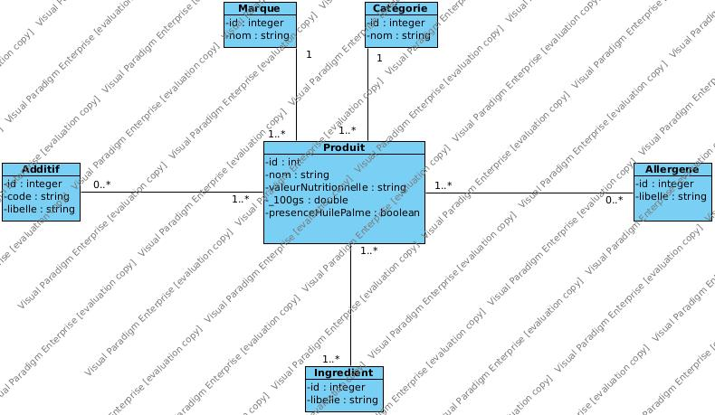

# OpenFoodFacts

## Le modèle de données

Diagramme de classe UML :

Modèle conceptuel de données :

Modèle conceptuel de données : 

## Fonctionnement du Tokeniser

---

Le parser de fichiers s'appuie sur les principes de parsing de fichier des compilateurs.

Pour faire cela, le est parcouru dans un premier temps caractère par caractère par un "Tokensier" (ou Lexer)
dans le but de transformer toutes les différentes combinaisons de caractère ayant du sens pour en faire
des objets avec lesquels le parser va pouvoir interagir.

Il y a plusieurs intérets à cette démarche:
 * L'optimisation de mémoire et de calcul : étant donné que cette démarche limite les opérations sur les
chaines de caractères, qui souvent créent des copies et demandent un peu de travail au processeur (notamment
dans le cas où l'on utilise des regexs), ici, on ne crée que les tokens à partir de la chaine de caractère
parcourue, et on utilise ensuite une boucle ne parcourant qu'une fois chaque token pour déterminer les
traitements à faire.
 * La flexibilité du traitement : étant donné que l'on se passe des méthodes de l'objet String, et que
l'on parcours tout caractère par caractère pour ensuite créer des tokens, on peut personnaliser à l'envie
le traitement de chaque token.

## Fonctionnement du parser de fichier:

---

Tout d'abord, le FileTokeniser va récupérer toutes les lignes du fichier et les transformer en tokens.
Si cela est rapide et pratique, il faudrait penser à ne tokeniser qu'un certain nombre de ligne du fichier
avant de les parse, faire quelque chose comme parse les lignes 10000 par 10000;

Pour cela, le parser ouvre un stream vers le fichier et applique la méthode de tokenisation sur chacune
d'elle. Ensuite, on ouvre deux virtual threads, chacun se chargeant de la moitié du fichier.

Ces virtualThreads font appel au LineParser, classe contenant la logique métier du parsing de chaque
token. Dans ce parser, on crée des entités, on les ajoute dans des listes, et chaque fois que l'on atteint
un certain nombre de produits dans la liste des produits, on persiste tout.
Pour la persistence, on crée un thread par entité liée à produit que l'on souhaite persister, et une fois
que les threads ont finis de s'exécuter, on persite les produits, ce qui va créer les liens entre les
produits et les ingrédients, additifs, marques, catégories et allergenes déjà en base.

Cette technique permet, sur une machine relativement performante, persister la totalité du fichier
CSV dans un temps qui varie entre 13 et 15 secondes, contre le précédent record de 35 minutes.

## Limitations

---

Si l'on voulait optimiser, on pourrait parcourir chaque ligne caractère par caractère sans créer de nouvel
objet token en mémoire.
* manque de clarté du code : cette architecture demande de faire le parsing des caractères dans la meme classe
que l'insertion, ce qui fait du parser une classe avec beaucoup de responsabilité, et la présence de bug
ou la nécessite d'apporter des modifications au comportement du parsing devient très complexe dès lors
que l'on traite des données où les règles de parsing sont non triviales.
* difficulté de généralisation : si l'on souhaitait créer une API de parsing de fichier CSV, cette méthode
rendrait la création d'une abstraction pour toute forme de fichier CSV impossible.

## Menu
Le menu est assez basique et manque de refactoring, mais permet d'avoir une API vers la base de données
proposant plusieurs options.

## Ouverture 

---

Il est possible d'imaginer la création d'un parser de fichier CSV à partir de ce projet.
Celui-ci demanderait de créer un fichier de configuration où l'on pourrait paramétrer les différents
tokens, et où l'on étendrait une classe mère abstraite ou implémenterait une interface avec des méthodes
par défaut pour créer le parser et l'adapter au fichier.
Étant donné l'efficacité de la méthode de parsing inspirée des compilateurs et l'utilisation de fonctionalités
de java 19+, cela pourrait permettre de créer une librairie plus intéressante que celles déjà disponibles
pour les très gros fichiers. Reste à travailler la lisibilité de l'API, ainsi que d'autres fichiers, comme
le choix d'intégrer ou non un module permettant d'insérer ses entités en base, etc.